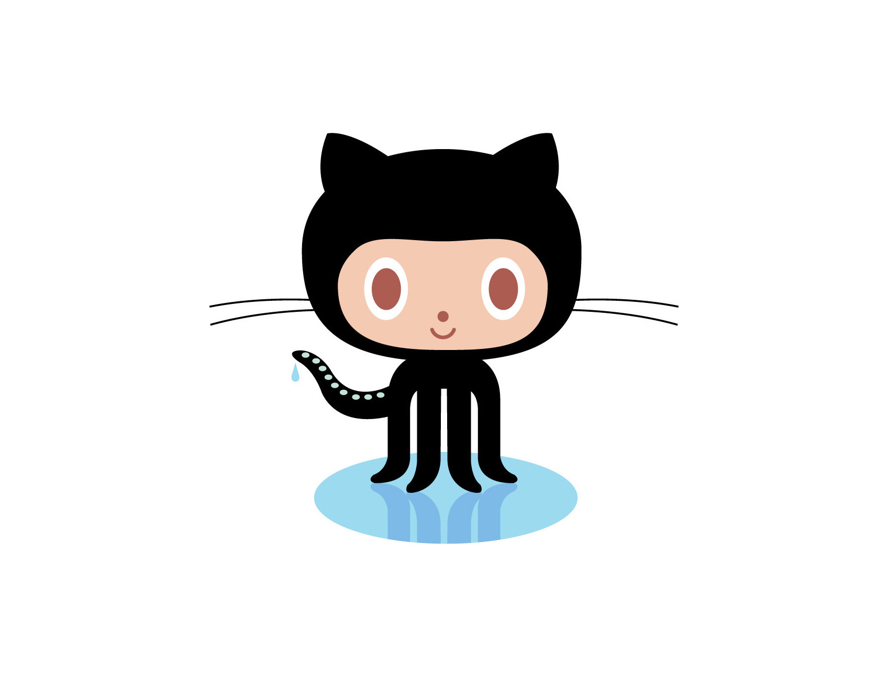

!SLIDE subsection

# why revision control? why git?

!SLIDE bullets
# What is a Revision Control?

* Revision control (an aspect of software configuration management), is the management of changes to
documents, computer programs, large web sites, and other collections of
information.  (Wikipedia)

!SLIDE 
# many names
  * version control system (VCS)
  * Versionskontrollsystem 
  * source code manager (SCM)
  * revision control system (RCS)

!SLIDE
#History (incomplete)

* RCS
* CVS
* SVN
* Mercurial
* Git

!SLIDE incremental
# Why use revision control?

* whole history of the project always accessible
* try out stuff without danger of breaking anything
* teamwork

!SLIDE 
# Why git?

!SLIDE 

!SLIDE 
# Why git?
* invented by linus torvalds

photo [cc](http://www.flickr.com/photos/48923114@N00/116787425)

!SLIDE dark
[video](http://www.youtube.com/embed/ntTpM8hfl_E?feature=player_detailpage)

!SLIDE 
# Why git? 
* invented by linus torvalds
* is used to manage the linux kernel

!SLIDE 
# Why git? 
* invented by linus torvalds
* is used to manage the linux kernel
* nice new logo 

!SLIDE incremental
.notes why - for real
# Why git?

* git is a distributed vcs
* you can work online and offline 
* architecture is not fixed: e.g. move to new central server
* branching and merging is easy
* only one directory: .git
* integrity of the code: identified by SHA1

!SLIDE 

!SLIDE incremental

# Why github?

* free for open source projects
* forking + pull requests
* convenient web interface
* cute octocat 

!SLIDE
# Resources for Learning Git

* [http://git-scm.com/documentation](http://git-scm.com/documentation)
* [http://progit.org/book/](http://progit.org/book/)
* [http://help.github.com/](http://help.github.com/)
* Loelinger(2009): Version Control with Git. O'Reilly Media.
* Swicegood(2009): Pragmatic Version Control Using Git. Pragmatic Bookshelf.

