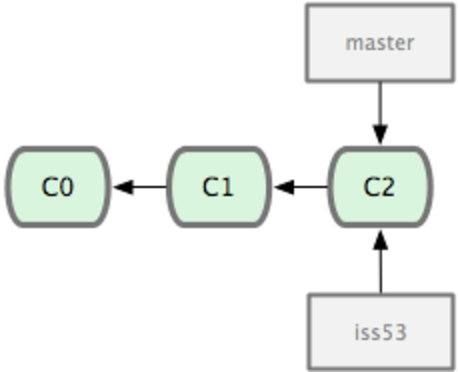
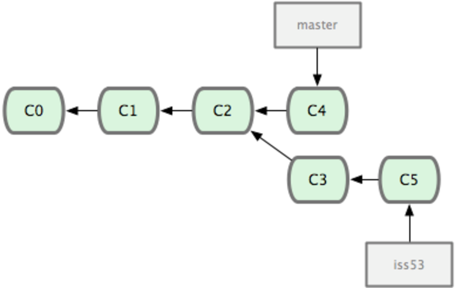
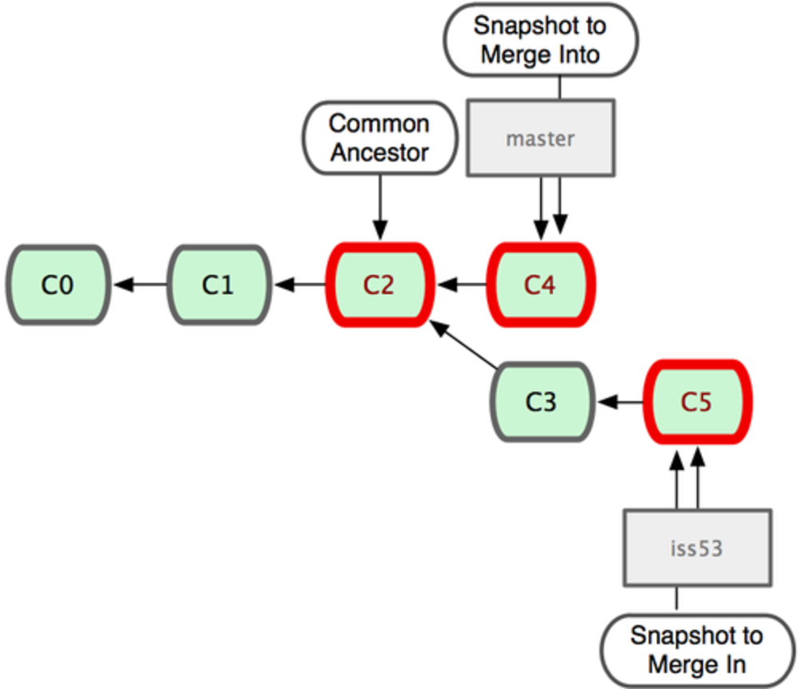
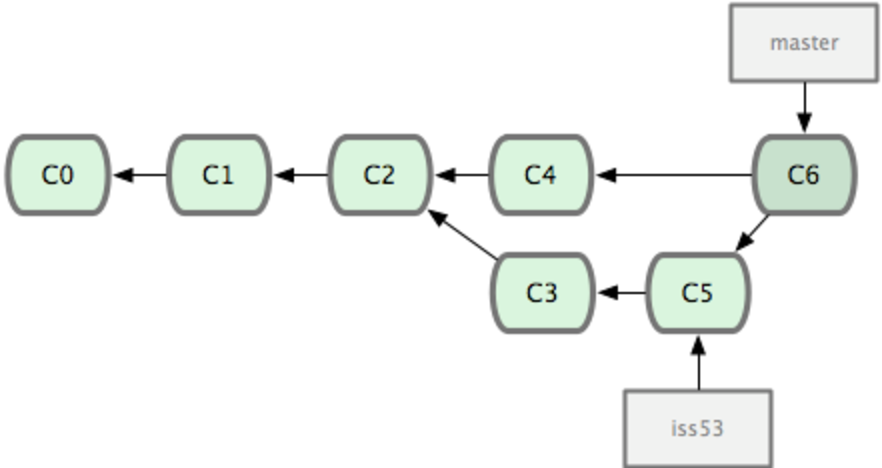

!SLIDE subsection

# Branching and Merging

!SLIDE
# Branching

        @@@ sh
        git branch -v # shows branches
        * master 7a98805 Merge branch 'iss49'
          iss50  782fd34 add scott to the author list in the readmes

        # create a branch 
        git branch BRANCH_NAME

        # delete a branch
        git branch -d BRANCH_NAME

        # get data from a different branch
        git checkout BRANCH_NAME

        # shortcut: create a new branch + checkout
        git checkout -b foo

!SLIDE
# Basic workflow: start

!SLIDE
# git checkout -b iss53

!SLIDE smaller
        @@@ sh
        # edit; commit(c3)
        $ git checkout master 
        # edit; commit(c4)
        $ git checkout iss53
        # edit; commit(c5)

!SLIDE

!SLIDE smaller
# merge!

        @@@ sh
        $ git checkout master
        $ git merge iss53
        Merge made by recursive.
         README |    1 +
         1 files changed, 1 insertions(+), 0 deletions(-)

!SLIDE
# done

!SLIDE
# git branch -d iss53

!SLIDE
# Merging in detail

        @@@ sh
        git merge OTHER_BRANCH

merge the OTHER_BRANCH into the current (checked-out) branch

!SLIDE incremental
# Conflicts

* when both branches contain changes for the same file
* or: trying two pushes containing changes for the same file

!SLIDE smaller
        @@@ sh
        $ git status
        index.html: needs merge
        # On branch master
        # Changed but not updated:
        #   (use "git add <file>..." to update what will be committed)
        #   (use "git checkout -- <file>..." to discard changes in working directory)
        #
        #   unmerged:   index.html
        #

!SLIDE smaller
# conflict markers in a file

        @@@ 
        

        <<<<<<< HEAD:index.html
        <footer>contact: support@github.com</footer>
        =======
        

          please contact us at support@github.com
        

        >>>>>>> iss53:index.html
        </body>
        </html>

!SLIDE 
# how to resolve
* for all files:
  * edit file
  * try out your changes!
  * git add FILE
* git commit

!SLIDE
# Do it!

[Chapter 3.2](http://git-scm.com/book/en/Git-Branching-Basic-Branching-and-Merging)

