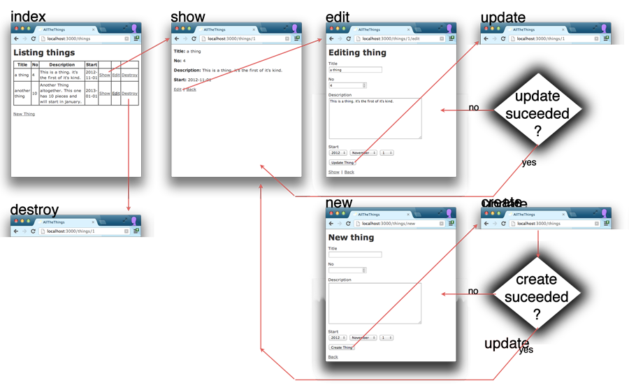

!SLIDE title-slide subsection

# rails controllers #

!SLIDE 

# restful resources

a rails convention about which http methods and urls
you should use, and which controllers and methods you should use.

in `config/routes.rb`  

    @@@ ruby
    resources :zombies

!SLIDE 

# restful resource

!SLIDE smaller

    @@@ 
    GET    /zombies          zombies_controller def index
    POST   /zombies          zombies_controller def create
    GET    /zombies/new      zombies_controller def new
    GET    /zombies/:id/edit zombies_controller def edit
    GET    /zombies/:id      zombies_controller def show
    PUT    /zombies/:id      zombies_controller def update
    DELETE /zombies/:id      zombies_controller def destroy

!SLIDE title-slide subsection

# Now do 'Rails for Zombies' Episode #4
