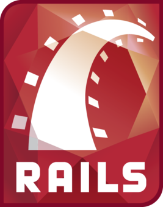

!SLIDE title-slide subsection

# rails with scaffold #

we will build our first rails project

but we will not really understand everything

!SLIDE

# What is ruby

!SLIDE incremental

# What is ruby

* open source
* scripting language
  * perl
  * python
  * <strike>php</strik>
* created by Yukihiro 'Matz' Matsumoto
* started in 1996

!SLIDE

# What is ruby on rails

!SLIDE incremental

# What is ruby on rails

* web framework written in ruby
* created by David Heinemeier Hansson 'DHH'
* starting in 2005

!SLIDE

# Why Rails ?

!SLIDE incremental

# Why Rails ?

* modern 
  * model - view - controller
  * test driven development
* strong principles
  * DRY - don't repeat yourself
  * convention over configuration
* dynamic community

!SLIDE 

# the end
